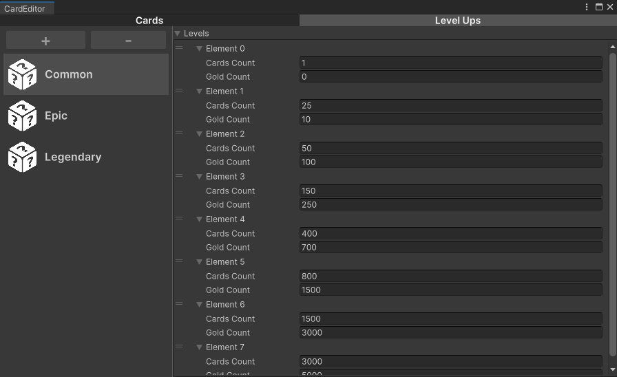
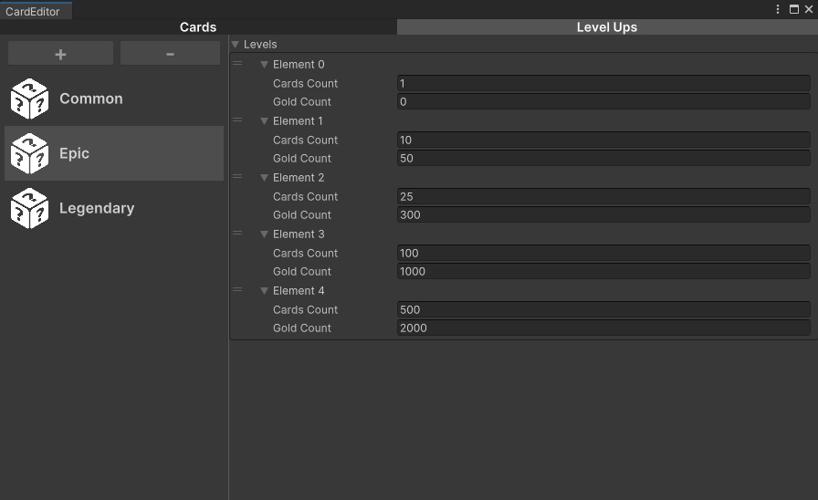
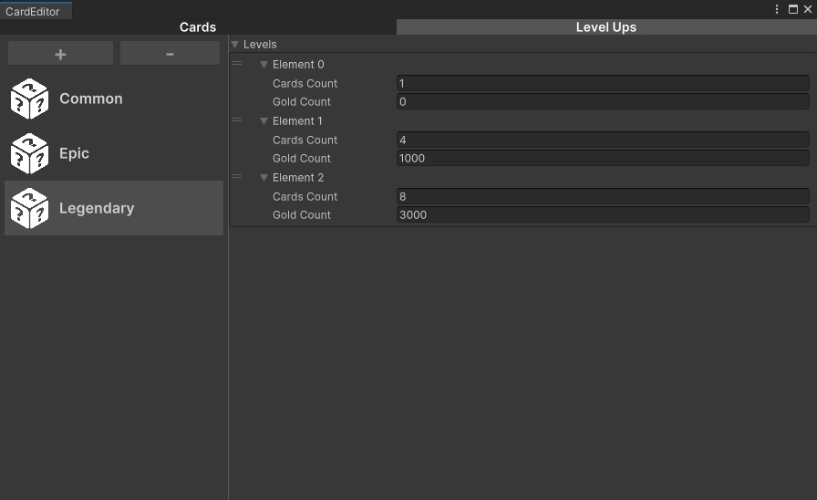
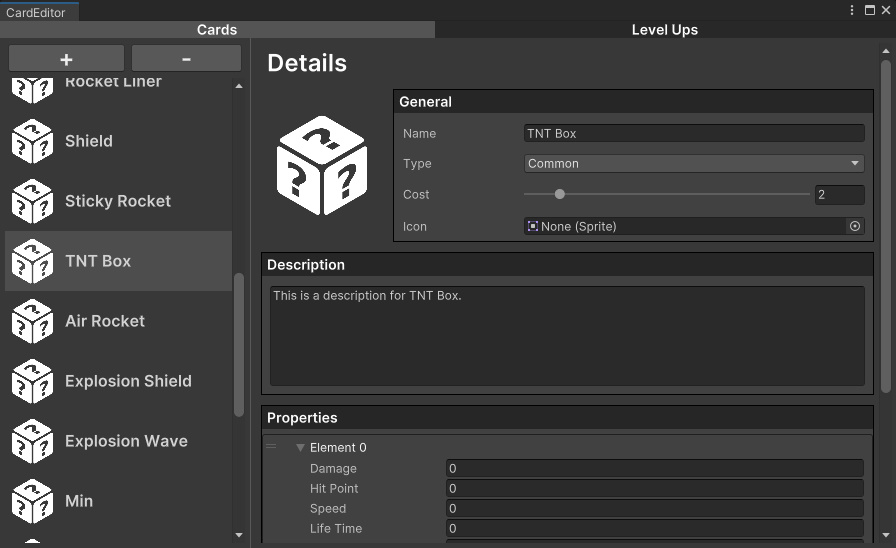
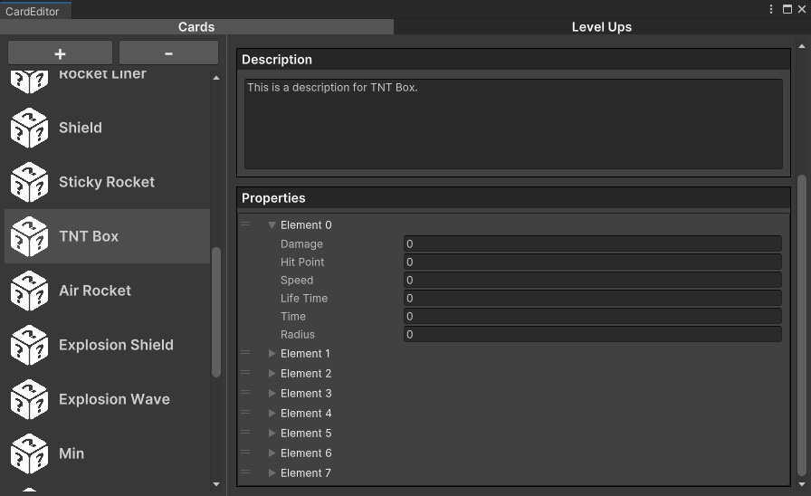

# CardEditor

🎴 **CardEditor** is a custom Unity editor tool developed to create, edit, and manage card data for a card-based game. It is built using Unity's modern UI framework, **UI Toolkit**, which enables the development of user-friendly and responsive editor interfaces.

This tool allows game developers or designers to streamline the process of editing card attributes without relying on external spreadsheets or manual asset editing. It’s ideal for use in games with collectible cards, ability cards, character cards, or any other data-driven card system.

---

## ✨ Features

- ✅ Built using **Unity UI Toolkit** for a native editor UI experience
- 🛠 Editable card fields:
  - Card Name
  - Image/Sprite Reference
  - Description
  - Stats (e.g. Power, Health, Cost)
  - Tags or Types
- 💾 Real-time updates reflected in the Unity Editor
- 📁 Modular architecture to easily add new fields or behaviors
- 🔍 Search and filter functionality for large card libraries *(coming soon)*
- 📤 Potential for export/import via JSON

---

## 📦 Requirements

- **Unity 2022.3** or newer (UI Toolkit compatible version)
- Editor scripting enabled
- UI Toolkit module installed

---

## 🚀 How to Use

1. **Clone the Repository**
   ```bash
   git clone https://github.com/Pixel0Void/CardEditor.git
   ```

2. **Open in Unity**

   Launch Unity Hub and open the cloned project.

3. **Access the Editor Tool**

   In Unity, go to:

   ```
   Window → CardEditor
   ```

   The custom editor window will open, allowing you to create or modify card data.

---

## 🛣️ Roadmap / TODO

- [ ] JSON export/import
- [ ] Card preview within the Game window
- [ ] Integration with external databases or Google Sheets
- [ ] User-defined card templates and layouts
- [ ] Search and filter cards

---

## 🖼️ Screenshots

<p float="left">
  
  
  
  
  
</p>

---

## 🙋‍♂️ Author

**Pixel0Void**  
[GitHub Profile](https://github.com/Pixel0Void)

---

Feel free to fork, contribute, or raise issues if you find bugs or have suggestions!
